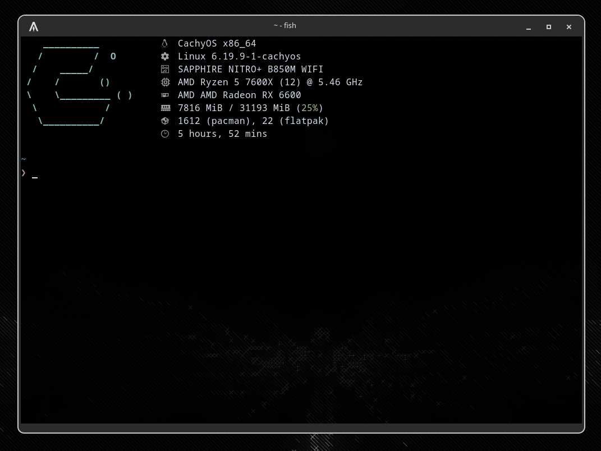

To set this as your logo, open ~/.config/fastfetch/config.jsonc.
Edit it so that the logo section looks like this:
```
"logo": {
  "source": "${XDG_CONFIG_HOME:-$HOME/.config}/fastfetch/cachyos_logo.txt"
}
```
Then just save the cachyos_logo.txt to ~/.config/fastfetch/ so it looks like this:
```
~/.config/fastfetch
├── cachyos_logo.txt
└── config.jsonc
```
And that's all, enjoy!
